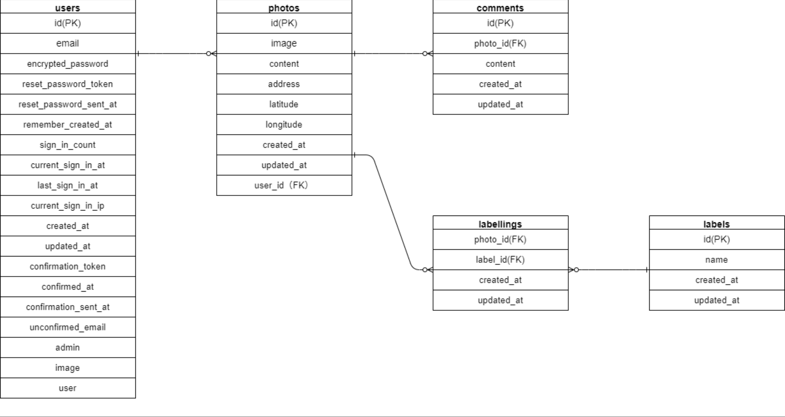
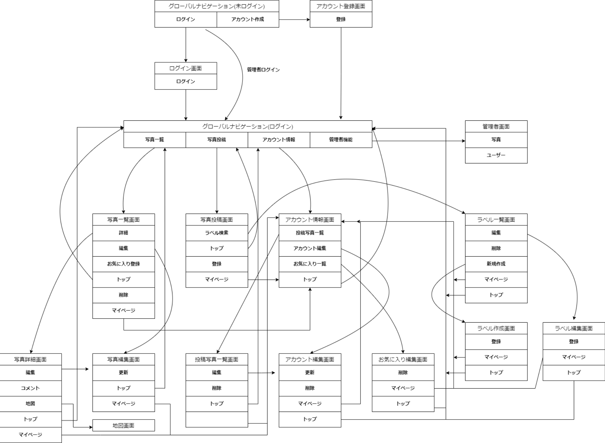

# README

# 開発言語
・ruby 3.0.1
・rails 6.0.4.7

# 就業Termの技術
・devise
・Ajaxを使ったコメント機能

# カリキュラム外の技術
・geocoder

# 実行手順  
```
$ git clone https://github.com/shouhei-yamamoto/price_net.git 
$ cd price_net  
$ bundle install  
$ rails db:create   
$ rails db:migrate  
$ rails s  
```

# カタログ設計
https://docs.google.com/spreadsheets/d/1UF3LbfHOn1XKuyxyrltGbESw6-Tx4ijLGsnAHlIX5fU/edit?usp=sharing

# テーブル定義書
https://docs.google.com/spreadsheets/d/1UF3LbfHOn1XKuyxyrltGbESw6-Tx4ijLGsnAHlIX5fU/edit?usp=sharing

# ワイヤーフレーム
https://cacoo.com/diagrams/gHj9m789nqGuPgs2/E3A90

# ER図  
https://cacoo.com/diagrams/gHj9m789nqGuPgs2/A06FE



# 画面遷移図
https://cacoo.com/diagrams/gHj9m789nqGuPgs2/F5CA5
